# [Assignment 1 : DFS, BFS, DFID]
###### 융합전자공학부 2015001103 조윤상
---
## 1. 목표
 uninformed search에 해당하는 DFS, BFS, DFID를 이용하여 N Queens Problem을 해결하여 본다.

## 2. 알고리즘 구성
   본 과제에서는 BFS, DFS, DFID 각각의 메소드와
   해 판별을 위한 CheckSafe 메소드를 구현하였다.

#### 2-1. 자료 구조
  * 체스판의 퀸들의 row 위치 : LinkedList<<Integer>>
  * BFS : Queue<LinkedList<Integer>>
  * DFS, DFID : Stack<LinkedList<Integer>>

#### 2-2. 해 판별 알고리즘(CheckSafe 메소드)
 * 입력 :  퀸들의 위치정보(LinkedList), 체스판의 크기(N)
 * 출력 :  boolean
 * 절차 :  
    1) 퀸의 개수가 N보다 작은지 판별한다.(N보다 작으면 찾고자 하는 해가 될 수 없다.)  
           ```if (list.size() < N)  return false; ```  
            
    2) 퀸의 개수가 N에 해당할 경우, 각 퀸이 이전 열들의 퀸들에 대해 안전한지를 확인한다.  
      * 같은 row 값을 가지는 퀸이 있으면, list 내의 동일한 원소가 있다.  
               ```if (list.get(j) == list.get(i))  return false;```
      * 대각선으로 만나는 퀸의 쌍이 있으면, 해당 퀸들의 값의 차이는 각각의 인덱스의 차이와 같다(아래 그림 참조).  
               ```if (list.get(j) == list.get(i) + i - j)   return false;```  
               ```if (list.get(j) == list.get(i) - i + j)   return false;```    

 
      3) 모든 퀸이 안전한 위치에 있는 경우 true를 반환한다.   
 * 참고: 대각선 방향으로 만나는 퀸들의 관계  


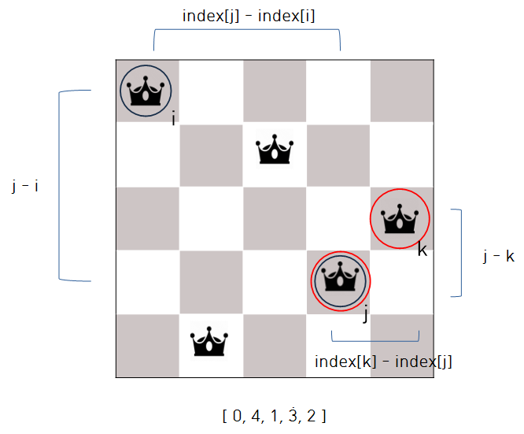   
 -> 대각선으로 만나는 퀸들의 값의 차이는 각각의 인덱스의 차이와 같다.  
 

#### 2-3. BFS 알고리즘(BFS 메소드)
 * 입력 : 체스판의 크기(N)  
 * 출력 : String (BFS 탐색 결과)  
 * 절차:	
1) 정수를 저장하는 연결 리스트 및 해당 리스트를 저장하는 큐를 생성한다.  
```
Queue<LinkedList<Integer>> q = new LinkedList<LinkedList<Integer>>();
  LinkedList<Integer> container = new LinkedList<Integer>();
```
2) 큐에 빈 리스트 1개를 저장한다(퀸이 하나도 없는 처음의 체스판 상태)  
```q.add((LinkedList<Integer>)container.clone());```  
3) 큐에서 원소(리스트)를 꺼내어 해당 원소가 찾는 해에 해당하는지를 판별하고, 찾는 해일 경우 해와 측정시간을 문자열에 저장하여 출력한다.  
```
container = q.remove();    
	if(CheckSafe(container, N)) {    
		Iterator<Integer> iterator = container.iterator();    
		str_bfs += "Location : ";    
		while(iterator.hasNext()) {    
				str_bfs = str_bfs + iterator.next() + " ";
			}    
		long endTime = System.nanoTime();											
		str_bfs = str_bfs + "\nTime : " + (endTime - startTime)/1000000000.0 + "\n\n";    
             return str_bfs;    
       }    
```    
4)  큐에서 꺼낸 원소(리스트)가 찾는 해에 해당하지 않으면, expand 하여 큐에 추가한다.  
	     (탐색을 수행한 리스트의 원소 개수가 N보다 작음을 검사하여 조건을 만족하면 해당 리스트에 각각 0 ~ (N-1)을 추가한  
	     N개의 새로운 리스트를 생성하여 큐에 저장한다.)  
```
if(container.size() < N) {  
	  for (i = 0; i < N ; i++)  
		container.addLast(i);    
	  q.add((LinkedList<Integer>)container.clone());  	  
	  container.removeLast();    
 }
 ```  
5) 큐에 저장된 원소가 없을 때까지 3), 4)의 과정을 반복한다.  
* 참고: BFS 알고리즘의 동작 방식  
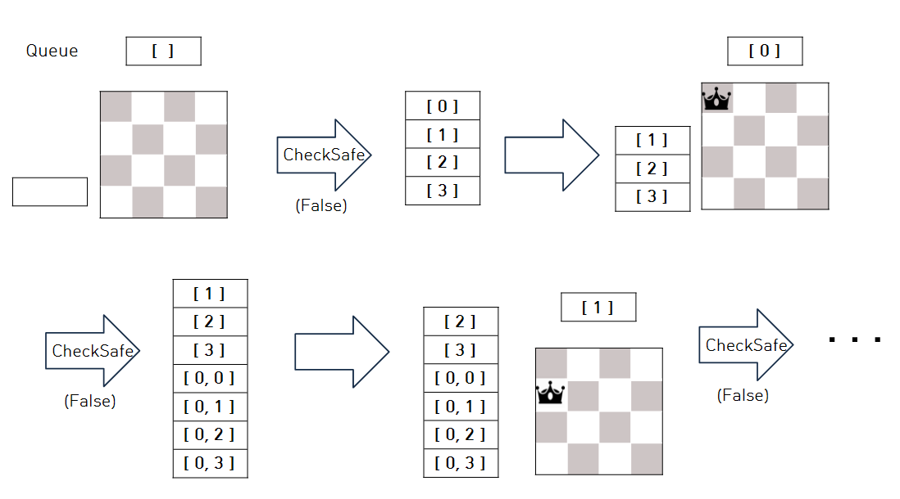  


#### 2-4. DFS 알고리즘(DFS 메소드)
 * 입력 : 체스판의 크기(N)  
 * 출력 : String (DFS 탐색 결과)  
 * 절차 :  
1) 정수를 저장하는 연결 리스트 및 해당 리스트를 저장하는 스택을 생성한다.  
```  
Stack<LinkedList<Integer>> s = new Stack<LinkedList<Integer>>();    
LinkedList<Integer> container = new LinkedList<Integer>();
```  
2) 스택에 빈 리스트 1개를 저장한다(퀸이 하나도 없는 처음의 체스판 상태)  
```s.push((LinkedList<Integer>)container.clone());```  
3) 스택에서 원소(리스트)를 꺼내어 해당 원소가 찾는 해에 해당하는지를 판별하고, 찾는 해일 경우 해와 측정시간을 문자열에 저장하여 출력한다.
```
container = s.pop();    
if(CheckSafe(container, N)) {    
	Iterator<Integer> iterator = container.iterator();    
	str_dfs += "Location : ";    
	while(iterator.hasNext()) {    
			str_dfs = str_dfs + iterator.next() + " ";
		}    
	long endTime = System.nanoTime();											
	str_dfs = str_dfs + "\nTime : " + (endTime - startTime)/1000000000.0 + "\n\n";    
  return str_dfs;    
    }    
```    
4)  스택에서 꺼낸 원소(리스트)가 찾는 해에 해당하지 않으면, expand 하여 스택에 추가한다.  
	     (탐색을 수행한 리스트의 원소 개수가 N보다 작음을 검사하여 조건을 만족하면 해당 리스트에 각각 0 ~ (N-1)을 추가한  
	     N개의 새로운 리스트를 생성하여 스택에 저장한다.)  
```
if(container.size() < N) {  
	  for (i = 0; i < N ; i++){   
		container.addLast(i);      
	  s.push((LinkedList<Integer>)container.clone());  	  
	  container.removeLast();    
}
```    
5) 큐에 저장된 원소가 없을 때까지 3), 4)의 과정을 반복한다.    
* 참고: DFS 알고리즘의 동작 방식  
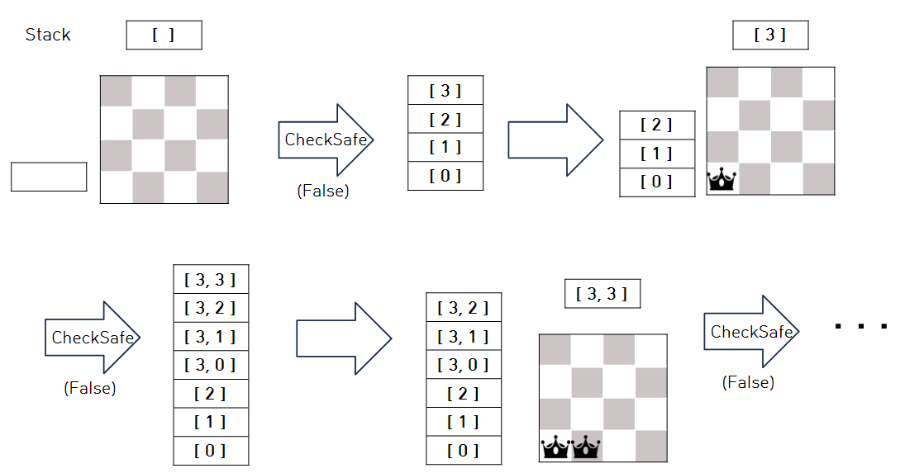    


#### 2-5. DFID 알고리즘(DFID 메소드)
 * 입력 : 체스판의 크기(N)  
 * 출력 : String(DFID) 탐색 결과

 * 절차 : 1 ~ N 의 limit에 대하여 다음 작업을 수행한다(각 limit에 대한 DFS 탐색 수행).    
	1) 정수를 저장하는 연결 리스트 및 해당 리스트를 저장하는 스택을 생성한다.  
```
Stack<LinkedList<Integer>> s = new Stack<LinkedList<Integer>>();    
LinkedList<Integer> container = new LinkedList<Integer>();
```  
	2) 스택에 빈 리스트 1개를 저장한다(퀸이 하나도 없는 처음의 체스판 상태)     
```s.push((LinkedList<Integer>)container.clone());```  
3) 스택에서 원소(리스트)를 꺼내어 해당 원소가 찾는 해에 해당하는지를 판별하고, 찾는 해일 경우 해와 측정시간을 문자열에 저장하여 출력한다.
```
container = s.pop();      
if(CheckSafe(container, N)) {    
	Iterator<Integer> iterator = container.iterator();    
	str_dfs += "Location : ";    
	while(iterator.hasNext()) {    
	str_dfs = str_dfs + iterator.next() + " ";
	}    
	long endTime = System.nanoTime();											
	str_dfs = str_dfs + "\nTime : " + (endTime - startTime)/1000000000.0 + "\n\n";    
  return str_dfs;    
}    
```    
4)  스택에서 꺼낸 원소(리스트)가 찾는 해에 해당하지 않으면, expand 하여 스택에 추가한다.   
	(탐색을 수행한 리스트의 원소 개수가 limit보다 작음을 검사하여 조건을 만족하면 해당 리스트에 각각 0 ~ (N-1)을 추가한  
	N개의 새로운 리스트를 생성하여 스택에 저장한다.)  
```
if(container.size() < limit) {  
	  for (i = 0; i < N ; i++){   
		container.addLast(i);      
	  s.push((LinkedList<Integer>)container.clone());  	  
	  container.removeLast();    
 }
 ```    
5) 큐에 저장된 원소가 없을 때까지 3), 4)의 과정을 반복한다.    
* 참고: DFID 알고리즘의 동작 방식  
    * limit = 1인 경우    
          
    * limit = 2인 경우  
      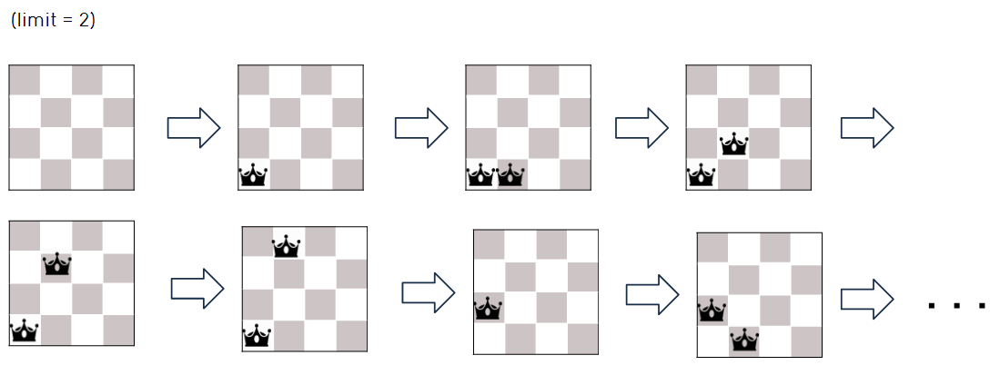  


#### 2-6. Main 메소드   
 * 절차:  
1) 입력받은 첫번째 Argument를 정수형으로 변환하여 저장한다.  
```int N = Integer.parseInt(args[0]);  ```   
2) 입력받은 두 번째 Argument가 나타내는 경로에 resultN.txt파일을 생성한다.  
```
String Address = args[1].replace("\\", "\\\\");    		
String Filename = "result" + args[0] + ".txt";    
String textfile = Address + "\\\\" + Filename;	    
File file = new File(textfile);    
```    
3) DFS, BFS, BFID 탐색을 수행하여 그 결과를 문자열로 저장한다.  
```
nQueens NQueens = new nQueens();    
String str_bfs, str_dfs, str_dfid;
String str;    
str_dfs = NQueens.DFS(N);    
str_bfs = NQueens.BFS(N);    						
str_dfid = NQueens.DFID(N);    						
str = str_dfs + str_bfs + str_dfid;    
```   	
4) 저장한 결과물을 resultN.txt파일에 작성한다.    
```
FileWriter fw = null;    
		try {    
			fw = new FileWriter(file, false);    
			fw.write(str);    				
			fw.flush();	    															
		} catch(IOException e) {    
			e.printStackTrace();    						
		} finally {    
			try {    
				if(fw != null) fw.close();    
			} catch(IOException e) {    				
				e.printStackTrace();    					
			}    
		}    
```    

## 3. 실행 결과    
##### n = 1 일 때  
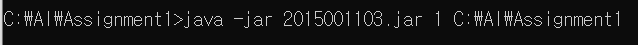    
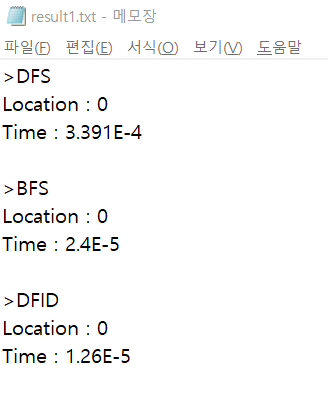    

##### n = 2 일 때  
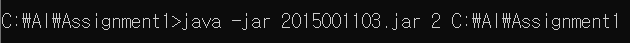  
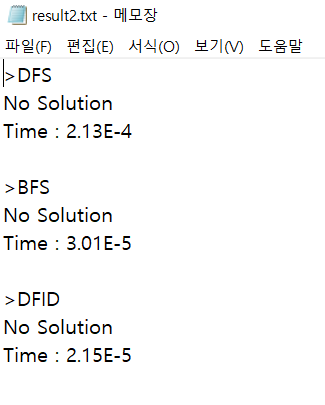  

##### n = 3 일 때   
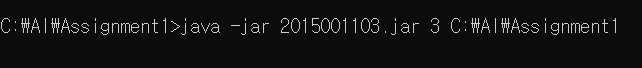   
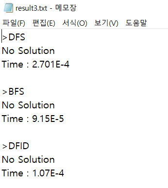   

##### n = 4 일 때   
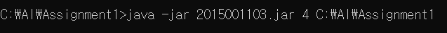   
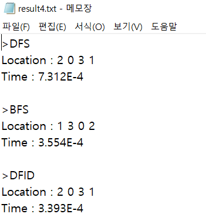    

##### n = 5 일 때   
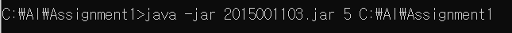   
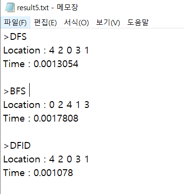     

##### n = 6 일 때   
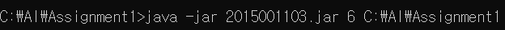   
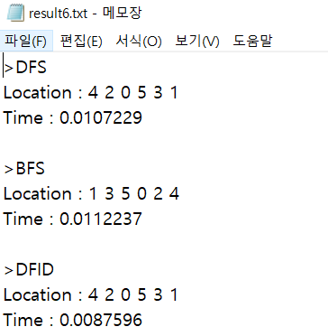   

##### n = 7 일 때   
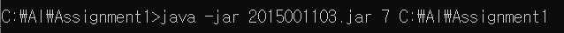   
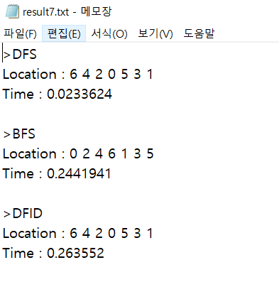    


