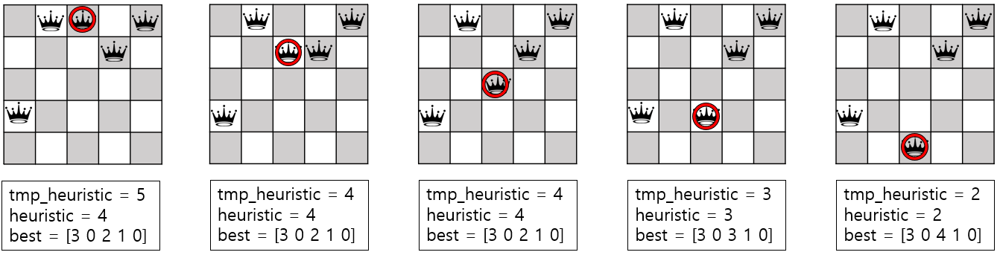

# [Assignment2 : Hill Climbing]
#### 융합전자공학부 2015001103 조윤상

### 1. 목표
Local Search 에 해당하는 Hill Climbing 기법으로 N-Queens 문제를 해결한다.<br /><br />

### 2. 알고리즘 구성
본 과제에서는 다음과 같은 방식으로 Hill Climbing을 구현하였다.<br />
1. NXN 체스판에 대하여 각 열의 임의의 위치에 Queen을 하나씩 배치한다.<br />
2. 해당 배치에 대한 heuristc 값을 계산한다.<br />    
    이때 heuristic은 각 열의 퀸의 위치 Q<sub>1</sub>, Q<sub>2</sub>, ... , Q<sub>n</sub> 에 대하여
    서로 공격 가능한 퀸의 쌍 (Q<sub>i</sub>,  Q<sub>j</sub>)  (1<span>&#8804;</span>i<span>&#60;</span>j<span>&#8804;</span>n)
    의 개수를 의미한다.  <br />
3. 첫번째 열부터 퀸의 위치를 조정하며 휴리스틱 값을 계산하고, 기존 휴리스틱 값보다 작은 값이 나오면 해당 배치를 업데이트한다.  <br />
4. 첫번째 열의 탐색 작업이 끝나면, 가장 작은 휴리스틱 값을 가지는 배치를 기준으로 두번째 열의 퀸의 위치를 조정하며 3의 작업을 반복한다.  <br />
5. 마지막 열까지 3~4의 과정을 반복한다.  <br />
6. 마지막까지 탐색하였음에도 탐색 전의 휴리스틱 값과 달라지지 않은 경우, Local optimum에 빠졌다고 간주하고 Restart한다.  <br />
7. 6의 경우에 해당하지 않는다면 휴리스틱 값이 0이 될때까지 3~5의 과정을 반복한다.  <br />
8. 휴리스틱 값이 0인 경우(모든 퀸이 서로를 공격할 수 없는 위치에 있는 경우), 해당 배치 및 소요 시간, Restart 횟수를 문자열에 저장하여 반환한다.  <br />
9. 반환받은 결과값을 resultN.txt 에 출력한다.  <br />

세부 메소드는 다음과 같다.  
##### <span>&#10112;</span>  generate :  퀸의 초기 배치를 랜덤한 위치로 생성 
i. 어레이리스트 및 랜덤변수를 생성한다.<br />
```
ArrayList<Integer> list = new ArrayList<Integer>();  
Random r = new Random();
```
ii. 각 열의 랜덤한 위치에 퀸을 1개씩 배치한다.<br />
```
for (int i=0; i<N; i++) {		
	list.add(r.nextInt(N));		
}
```
iii. 해당 배치를 반환한다.<br />
```
return list;
```
<br /><br />

##### <span>&#10113;</span>  Heuristic :  입력받은 배치에 대한 휴리스틱 값 반환 
i. 1X1사이즈의 체스판일 경우, 휴리스틱이 0이므로 이를 반환한다.<br />
```
int i, j;
int heuristic = 0;		
if (list.size() == 1) return heuristic;
```
ii. 같은 row값을 가지거나(좌우로 만남), 위치의 차가 인덱스의 차이와 같은(대각선으로 만남) 퀸의 쌍을 발견하면 휴리스틱을 1증가시킨다.<br />
```
for (i = 1; i < list.size() ; i++) {						
	for (j = 0; j < i ; j++){		
		if (list.get(j) == list.get(i))				// 같은 row 값을 가지는 퀸이 있으면
			heuristic++;							// heuristic을 1 증가시킨다.
		if (Math.abs(list.get(i) - list.get(j)) == Math.abs(i - j))		// 대각선 방면에 퀸이 있으면
			heuristic++;							// heuristic을 1 증가시킨다.
		}
}
```
iii. 탐색이 끝나면 휴리스틱을 반환한다.<br />
```
return heuristic;
```
<br /><br />

##### <span>&#10114;</span>  HillClimbing :  NXN 체스판에 대한 HillClimbing 작업 수행
i. 시작 시각 측정<br />
```
long startTime = System.nanoTime();
```
ii. N이 1보다 작거나, 2 또는 3이면 n-queens problem의 해가 존재하지 않는다.<br />
```
if(N < 1 || N == 2 || N == 3) {				// N이 음수이거나 2또는 3인 경우 해는 존재하지 않는다.
	str += "No Solution\n\n";
	return str;
}
```
iii. 탐색 작업에 사용할 어레이리스트 tmp와 최선의 상태를 저장할 어레이스트 best를 선언한다.<br />
```
ArrayList<Integer> best = new ArrayList<Integer>();	// 최선의 퀸 배치
ArrayList<Integer> tmp = new ArrayList<Integer>();	// 탐색할 퀸 배치
```
iv. generate 메소드를 이용하여 퀸의 초기 배치를 랜덤한 위치로 생성하고, 그에 따른 초기 휴리스틱 값을 저장한다.<br />
```
tmp = generate(N);
best = (ArrayList<Integer>)tmp.clone();		
int heuristic = Heuristic(tmp);				// 초기 휴리스틱 값
int tmpheuristic = Heuristic(tmp);
```
v. Restart 횟수 변수 및 local optimum 체크 변수를 생성한다.<br />
```
int countRestart = 0;
int heuristic_before;					// Local optimal 에 빠졌는지 체크하는 인자
```
다음의 과정은 while 반복문 내에서 실행된다.<br />
vi. 탐색 시작 전, 현재의 휴리스틱 값을 저장하고, 이 값이 0에 해당하는지 확인한다.<br />
```
heuristic_before = heuristic;		// Hill Climb 시작 전, 현재의 휴리스틱을 저장한다.

if(heuristic == 0) {			// 생성된 queen의 초기 위치가 처음부터 조건을 만족할 경우
	Iterator<Integer> iterator = tmp.iterator();
	while(iterator.hasNext()) {
		str = str + iterator.next() + " ";		// 해당 위치를 문자열에 저장
	}
	long endTime = System.nanoTime();			// 종료 시각 측정
	str = str + "\nTotal Elapsed Time : " + (endTime - startTime)/1000000000.0;		// 소요 시간
	str = str + "\nNumber of Restart : " + countRestart + "\n\n";			// Restart 횟수
	return str;						// 문자열 반환
}
```
vii.  퀸의 위치를 조정하며 휴리스틱 값을 계산하고, 기존 휴리스틱 값보다 작은 값이 나오면 해당 배치 및 휴리스틱 값을 업데이트한다.<br />
     첫번째 column에 대하여 이 작업이 완료되면, 두번째 column의 퀸의 위치를 조정하며, 이후 n번째 column까지 이 작업을 반복한다.<br />
     휴리스틱 값이 0인 경우를 발견하면 탐색을 종료하고 해당 배치 및 소요시간, 재시작 횟수를 문자열에 저장하여 반환한다.<br />
```
for(int i = 0; i<N; i++) {						// 모든 열에 대하여 다음을 반복한다.
	for(int j = 0; j<N; j++) {
		tmp.set(i,j);							// tmp의 i번째 원소를 1에서 N까지 바꾸어 본다.
		tmpheuristic = Heuristic(tmp);			// 휴리스틱을 새롭게 계산한다.
		if(tmpheuristic < heuristic) {			// 기존 휴리스틱보다 새로운 휴리스틱이 작으면
			best = (ArrayList<Integer>)tmp.clone();	// 해당 위치정보를 next에 저장하고
			heuristic = tmpheuristic;			// 휴리스틱 값을 업데이트한다.
			if(tmpheuristic == 0) {				// 휴리스틱이 0인 경우(조건을 만족하는 경우)
				Iterator<Integer> iterator = best.iterator();
				while(iterator.hasNext()) {
					str = str + iterator.next() + " ";		// 해당 위치를 문자열에 저장한다.
				}
				long endTime = System.nanoTime();			// 종료 시각을 측정
				str = str + "\nTotal Elapsed Time : " + (endTime - startTime)/1000000000.0;	// 소요 시간
				str = str + "\nNumber of Restart : " + countRestart + "\n\n";	// 재시작 횟수
				return str;							// 문자열 반환
			}
		}
	}
}
```
viii. 모든 column에 대하여 위의 작업을 수행하였음에도 휴리스틱 값이 변하지 않은 경우, local optimum에 해당한다고 간주하고,<br />
    새롭게 체스판 배치를 생성하여 Restart한다.<br />
```
if(heuristic_before == heuristic) {		 // 체스판의 모든 열에 대하여 Hill Climbing 작업을 수행하여도 휴리스틱 값이 변하지 않은 경우
								           // Local optimum에 빠졌다고 보고, Restart 한다.
		countRestart++;						// Restart 횟수 증가
		tmp = generate(N);					// 체스판을 새롭게 생성
		heuristic = Heuristic(tmp);			// 새로운 체스판에 대한 휴리스틱
		tmpheuristic = heuristic;		
}
```
<br />


##### <span>&#10114;</span>  main :  메인 실행 함수 
i. argument로서 첫번째 인자로 N을, 두번째 인자로 resultN.txt파일의 경로를 입력받는다.<br />
```
int N = Integer.parseInt(args[0]);					// 첫번째 인자(차수)
String Address = args[1].replace("\\", "\\\\");		// 두번째 인자(파일주소)
String Filename = "result"+N+".txt";
String File = Address + "\\\\" + Filename;
```
ii. 입력받은 차수 N에 대하여 Hill Climbing 방식으로 n-queens 문제를 풀어 그 결과를 얻는다.<br />
```
String result = "";
result = HillClimbing(N);					// HillClimbing 탐색 수행
```
iii. 해당 결과를 resultN.txt 이라는 파일명으로 입력받은 경로에 작성한다.<br />
```
FileWriter fw = null;

try {
		fw = new FileWriter(File, true);		
		fw.write(result);						// 해당 위치에 resultN.txt 생성 후 결과 작성
		fw.flush();								
	} catch(IOException e) {					// 입출력 에러 발생시
		e.printStackTrace();
	} finally {
		try {
			if(fw != null) fw.close();			
		} catch(IOException e) {				// 입출력 에러 발생시
			e.printStackTrace();
		}
	}
}
```
<br /><br />
<span>&#8251;</span> 본 프로그램의 실행 과정을 도식화하면 다음과 같다.(N=5라 가정)<br /><br />
i. 랜덤으로 초기 배치 생성 <br />
   이때 초기 배치가 [4 1 2 1 0]으로 형성되었다고 가정한다.

<br />
2) 첫번째 Column값을 변화시키면서 휴리스틱 값이 가장 작은 경우를 찾는다.<br />

이때 최선의 결과는 휴리스틱이 5인 [3 1 2 1 0] 인 경우로, 이를 저장하고 다음 칼럼으로 넘어간다.<br /><br /><br />
3) 두번째 Column값을 변화시키면서 휴리스틱 값이 가장 작은 경우를 찾는다.<br />

이때 최선의 결과는 휴리스틱이 3인 [3 0 2 1 0] 인 경우로, 이를 저장하고 다음 칼럼으로 넘어간다.<br /><br /><br />
4) 마지막 Column까지 휴리스틱 탐색 과정을 수행한다.<br />

<br /><br />
5) 마지막 Column까지 탐색 작업을 수행한 결과물은 휴리스틱이 1인 [3 0 4 1 1]이다.<br />
   이는 탐색 수행 전 [4 1 2 1 0]의 휴리스틱 8보다 작으므로, 다시 첫번째 Column부터 탐색을 수행한다.<br />
<br /><br />
6) [3 0 4 1 1]의 모든 column에 대해 local search를 하여도 여전히 결과물은 [3 0 4 1 1] 로, 휴리스틱이 바뀌지 않게 된다.<br />
  따라서 더 이상의 탐색을 중단하고, 새로운 배치를 생성해 Restart한다.([2 3 0 4 2]가 생성되었다고 가정)<br />
<br /><br />
7) 휴리스틱 값이 0이 될 때까지 2)~6) 과정을 반복한다.<br />
<br /><br /><br />


<h3>3. 실행 결과</h3>
<br />1. N = 1 일 때<br />


<br />2. N = 2 일 때<br />


<br />3. N = 3 일 때<br />


<br />4. N = 4 일 때<br />


<br />5. N = 5 일 때<br />


<br />6. N = 6 일 때<br />


<br />7. N = 7 일 때<br />


<br />8. N = 8 일 때<br />


<br />9. N = 9 일 때<br />


<br />10. N = 10 일 때<br />


<br />11. N = 11 일 때<br />

<br /><br /><br />

<h3> 4. 결과 분석</h3>
1. 평균 Restart 횟수를 구하기 위하여 N = 4 ~ 10에 대하여 10번씩 수행한 결과는 아래와 같았다.<br />
<br /><br />
2. NXN 체스판에 대하여 각 column에 퀸을 하나씩 배치했을 때, 퀸의 배치의 경우의 수는 N<sup>N</sup> 에 해당한다.<br />
  따라서 문제의 해의 개수를 f(N) 이라 하면, 다음이 성립한다.
<br /><br />
이를 토대로 N = 4~10 일 때 해의 개수를 추정해 보면 다음과 같다.<br />

