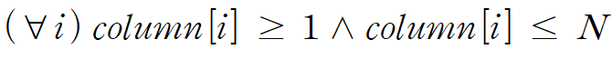
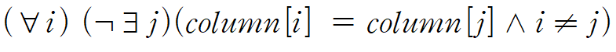
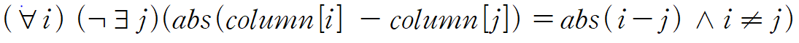
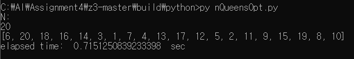
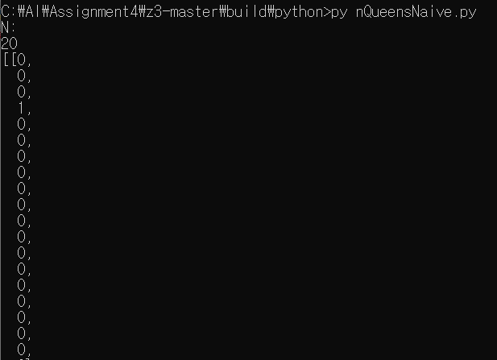
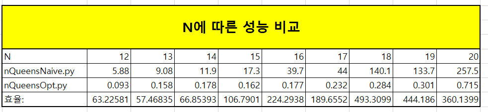

# [Assignment4 : SAT Solver]
#### 융합전자공학부 2015001103 조윤상<br /><br />

### 1. 목표
Propositional logic문제를 다루는 SAT solver z3를 이용하여 N-Queens 문제를 해결한다.<br /><br />

### 2. 알고리즘 구성
본 과제에서는 다음과 같이 Propositional logic을 z3 solver 을 이용하여 구성하였다.<br /><br />
<span>&#8251;</span> 우선 다음 코드를 통해 Solver 모델을 선언하였다.
```
s = Solver()  
```

##### 1) Variables:  각 컬럼<br />
  이때 IntVector을 활용하여 column 변수를 정의함으로써,  i번째 컬럼은 column[i]로 표현하도록 하였다.<br />
  따라서 column[i] 혹은 i를 Symbol로 사용할 수 있다.  (이때 i=0, 1, ..., N-1)  <br /><br />
```
column = IntVector("column",N)
```

##### 2) formula: 도메인 및 제약사항은 다음의 formula를 사용하여 구현하였다.<br /><br />
###### <span>&#10112;</span> 도메인 : 각 Symbol은 1~N 의 값을 가질 수 있다.

이는 다음과 같이 구현하였다.<br />
```
domain = [And(column[i]>=1, column[i]<=N) for i in range(N)]
s.add(domain)
```
<br />
###### <span>&#10113;</span> 제약사항 : 가로 방향 또는 대각선 방향으로 만나는 퀸이 없다.<br />
(i) 가로 방향으로 만나는 퀸이 존재하지 않는다.

이는 다음과 같이 구현하였다.<br />
```
for i in range(N):
    for j in range(i):                  # 서로 다른 i, j
        s.add(column[i] != column[j]) 
```
<br />
(ii) 대각선 방향으로 만나는 퀸이 존재하지 않는다.

이는 다음과 같이 구현하였다.<br />
```
for i in range(N):
    for j in range(i):                  # 서로 다른 i, j
        s.add([And(column[i] - column[j] != i-j, column[i] - column[j] != j-i)])
```
<br /><br />

<span>&#8251;</span> 모델에 모든 조건을 추가하고 나면, 다음  코드를 활용하여 해를 출력하였다.<br />
```
if s.check() == sat:                    # Solver 모델이 해를 찾을 경우
    m = s.model()                       # 생성된 모델
    r = [m.evaluate(column[i]) for i in range(N)]   # 해의 퀸의 위치를 나타내는 리스트
    print(r)                            # 퀸의 위치 리스트 출력

else:                                   # Solver 모델이 해 찾기에 실패할 경우
    print("failed to solve")
```
<br /><br />
### 3. 실험 결과
실행화면(N=20일 때)<br />


<br /><span>&#8251;</span> nQueensNaive.py와의 비교<br />

--------------------------------------- (중략) ---------------------------------------<br />

<br /> 소요 시간을 비교해 보면 약 350배 차이남을 알 수 있다.<br /><br />

### 4. 결과 분석
###### <span>&#10112;</span> Optimization 방법(nQueensNaive.py와의 비교)<br />
 * IntVector을 이용해 변수를 N개의 정수를 원소로 가지는 1개의 벡터로 줄였다. (nQueensNaive.py의 경우는 변수의 개수가 NXN개이다.)
 * 대각선 방향으로 만나는 퀸이 없도록 제약상황을 설정할 경우, 두 비교대상이 '동일하지 않다.'라는 조건이 필요하다.<br />
```
 digConst = [Implies(And(X[i][j] == 1, X[k][h] == 1,
            i != k, j != h), abs(k - i) != abs(j - h))
            for i in range(N) for j in range(N) 
            for k in range(N) for h in range(N)] 
```
   nQueensNaive.py의 경우는 위에서 i!=k, j!=h와 같이 이를 조건에 추가하는 식으로 구현하였으나,<br />
  본인이 최적화한 nQueensOpt.py의 경우 아래와 같이 애초에 해당 조건을 명시하지 않아도 저절로 서로 다른 대상을 비교할 수 있도록 설정하였다.
```
for i in range(N):
    for j in range(i):                  # 서로 다른 i, j
        s.add([And(column[i] - column[j] != i-j, column[i] - column[j] != j-i)])
```
<br />
###### <span>&#10113;</span> N에 따른 성능 분석<br />
nQueensNaive.py와 nQueensOpt.py를 12~20의 N에 대하여 소요 시간을 비교해보면 다음과 같았다.<br />

위의 표에서 '효율'을 보면 대략적으로 N이 증가할수록 nQueensOpt.py가 nQueensNaive.py보다 효율적임을 확인할 수 있다.
